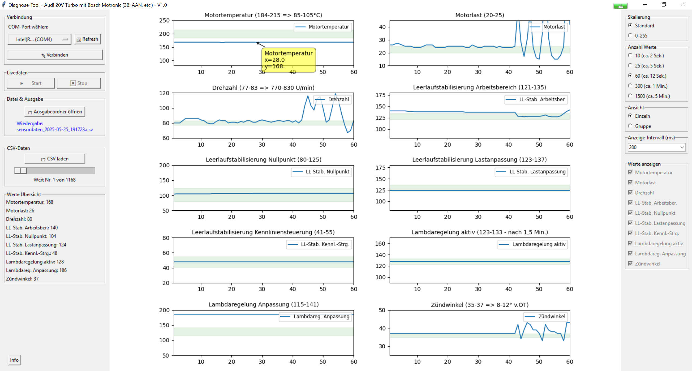
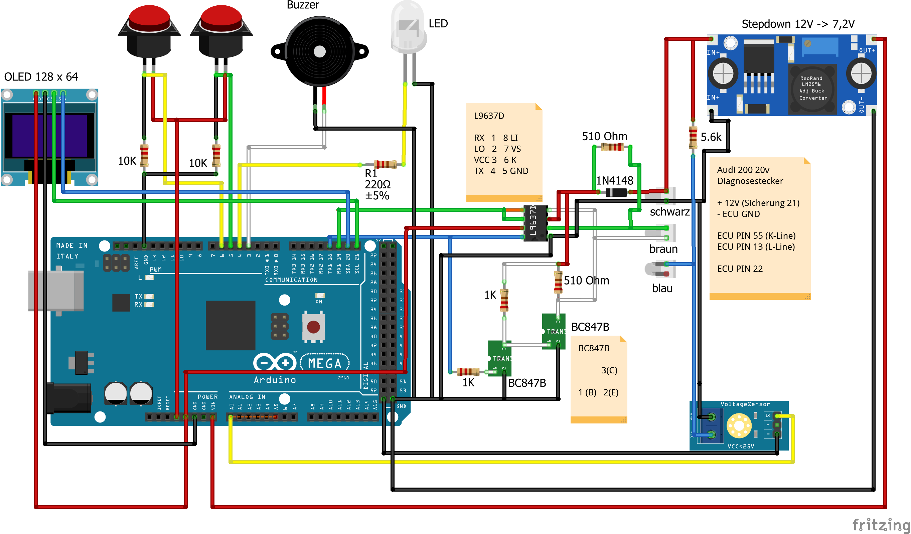

# Audi 20V Turbo Diagnosegerät (Bosch Motronic)

Das ist ein Diagnosegerät zum selber bauen. Es passt ins Handschuhfach, ist benutzerfreundlich und komplett Open Source. Für genauere Analysen gibts noch ein auf die 10 Sensorwerte angepasstes Auswertungstool dazu.

🔽 [aktuelle ZIP-Datei herunterladen (Version 1.0.0)](https://github.com/mkahres/diagnosegeraetAudi20vTurbo/archive/refs/heads/master.zip)

<table>
  <tr>
    <td></td>
    <td></td>
  </tr>
</table>

---

## 📲 Bedienung und Infos zum Nachbauen

youtube-Video: https://www.youtube.com/watch?v=6eNAYaNCjRk

Bei Fragen kommentiert am besten unter dem Video oder legt hier einen Issue an.

---

## 🔧 Funktionen

- ✅ **Fehlerspeicher auslesen über K-Line**
- ✅ **Fehlerspeicher ausblinken**
- ✅ **Fehlerspeicher löschen**
- ✅ **Stellglieddiagnose über K-Line**
- ✅ **Stellglieddiagnose mit Blinkcode**
- ✅ **Sensorwerte live auslesen**
- ✅ **Speichern & Laden von Sensordaten und Fehlerspeicher**
- ✅ **Stromversorgung über Diagnosestecker im Auto**
- ✅ **Das zusätzliche Auswertungstool erlaubt genauere Betrachtung der Diagnosewerte über Laptop**
- 🐣 **Easteregg inklusive 😎**

---

## 🚗 Unterstützte Fahrzeuge

Ich habe es nur an meinem Audi 200 20V getestet, daher keine Garantie! Da sich die Steuergeräte bei diesen Motoren nicht unterscheiden, dürfte es bei folgenden Fahrzeugen problemlos funktionieren:
- **Audi 200 20V (3B)**
- **Audi S2 (3B)**
- **Audi S4 / S6 C4 (AAN)**
- **Audi Urquattro 20V (RR)**

eingeschränkt verwendbar:
- **20V Turbos mit ABY, ADU, etc.:**
bei den "neueren" 20V Turbos können mehr als die 10 Sensoren ausgelesen werden. Dies ist mit dem Tool aktuell nicht möglich. Falls jemand Bock hat, die verwendete Library KLineKWP1281Lib unterstützt das Auslesen sämtlicher Gruppen. Es wäre also theoretisch möglich das Tool zu erweitern. Evtl. gibt es bei den Motoren auch mehr Fehlercodes und andere Fehlertexte.

mit kleinen Änderungen verwendbar:
- **Audi 100/200 (NF/MC und andere):**
bei den Motoren die nur das Ausblinken unterstützen muss die Hardware etwas geändert werden. Außerdem sind kleine Anpassungen in der Software-Konfiguration notwendig (siehe [Anmerkungen](#-anmerkungen))

---

## ⚡ Schaltplan

---

## 🖥️ Setup & Upload

**Arduino**
- aktuelle Arduino IDE installieren: https://www.arduino.cc/en/software/
- den Sketch (/diagnoseGeraet/diagnoseGeraet.ino) in der IDE öffnen
- folgende Libraries über den Library Manager installieren (https://docs.arduino.cc/software/ide-v1/tutorials/installing-libraries/#using-the-library-manager):
   - Adafruit_SH110X
   - U8g2_for_Adafruit_GFX
- die Library KLineKWP1281Lib von dieser Seite herunterladen (unter Getting started - latest Release) https://github.com/domnulvlad/KLineKWP1281Lib/tree/main und als ZIP-Library einbinden (siehe hier: https://docs.arduino.cc/software/ide-v1/tutorials/installing-libraries/#importing-a-zip-library)
- Board und Port auswählen und den Sketch über den Upload-Button auf den Arduino laden (https://support.arduino.cc/hc/en-us/articles/4733418441116-Upload-a-sketch-in-Arduino-IDE)

**Python**  
- aktuelles Python Release installieren für das Auswertungs-Tool: https://www.python.org/downloads/
- Doppelklick auf /diagnoseAuswertung/startTool.bat zum Starten des Tools

---

## 🛒 Einkaufsliste

- Arduino Mega oder Clone (hier wurde ein Elegoo Mega verwendet)
- L9637D I/O-Controller-IC-Interface
- 1,3 Zoll OLED Display (mit 0,96 Zoll funktioniert der Code nicht, da das eine andere Library benötigt!)
- 2x Diagnose Adapterkabel 2x2 OBD
- 5-adriges Kabel vom Diagnosestecker zum Tool
- 2x JST SM Stecker für Verbindung Adapterkabel -> 5-adriges Kabel -> Arduino
- Gummitülle für das Kabel das ins Gehäuse geht
- LM2596S Step Down Converter
- Spannungssensor DC 0~25V
- LED ⌀ 3mm
- 2x Push Button 12mm mit Mutter
- Buzzer
- 2x Widerstand 510 Ω (L9637d Spezifikation - bitte genau daran halten)
- 4x Widerstand 1K Ω
- 1x Widerstand 5.6k Ω
- 1x Widerstand 220 Ω
- Diode 1N4148
- 2x Transistor BC847B
- viele Jumperkabel und -stecker
  
Folgende Teile fand ich hilfreich, damit passt dann alles in das kleine Gehäuse rein.
- SOT23 Adapterplatine (für die Transistoren)
- Adafruit SMT Breakout Leiterplatte für SOIC-8 (für den L9637D)
- EPLZON Prototype Board 2 x 1,5 Zoll (da hab ich dann die Platinen, die Widerstände und die Diode draufgelötet)

Für Fahrzeuge die nur das Ausblinken unterstützen braucht man anstatt des L9637D, den Transistoren, Widerständen usw. nur ein Relais
- z.B. AZDelivery KY-019

---

## 📌 Anmerkungen

**Ausblinken mit Relais für NF, MC etc.** 

Für Motoren ohne K-Line Schnittstelle die nur Ausblinken unterstützen muss statt des L9637D ein Relais verwendet werden um die Drahtbrücke zu schließen. Die Verkabelung für den Spannungsmesser um die Blinkcodes zu erkennen muss dann auch geändert werden. 
Fehlercodes und -texte sind für NF und MC bereits im Code hinterlegt. Man muss nur die Konfiguration in der Datei "Constants.h" anpassen:

<pre>const char ENGINE = "3B"; //mögliche Werte: "3B", "MC", "NF"  - für RR, AAN, etc. verwende "3B"
#define USE_RELAIS false //für MC, NF, etc. auf true setzen
#define PIN_RELAY 12 //für MC, NF, etc. den Relais PIN setzen</pre>

**Ausblinken beim 20v Turbo**

Die Ausblinkfunktion wird beim 20v Turbo über den L9637D gesteuert. Theoretisch ist das Ausblinken für den 20V gar nicht notwendig, da alle Funktionen über K-Line verfügbar sind. Wenn man darauf verzichten will kann man folgende Teile weglassen:
- Spannungsmesser
- von den Diagnoseadapter-Kabeln 2x2 braucht man nur noch einen Satz, da dann der blaue Stecker nicht mehr verwendet wird  
- LED weglassen oder besser immer auf an setzen. Dazu in diagnoseGeraetAudi200.ino irgendwo in der Funktion setup() diese Zeile hinzufügen: <pre>analogWrite(ledPin, 5);</pre>

**Debugging** 

Sollte es Probleme bei der K-Line Kommunikation geben kann man in configuration.h das Debugging aktivieren (beide Werte auf "true"). Das sollte man nur zum Testen einschalten, da die Debugging-Ausgaben die Kommunikation mit dem Auswertungstool behindern.

<pre>// Enable/disable printing library debug information on the Serial Monitor.
// You may change the debug level in "KLineKWP1281Lib.h".
#define debug_info false
// Enable/disable printing bus traffic on the Serial Monitor.
#define debug_traffic false</pre>

**Stromversorgung**

Die Versorgung erfolgt über einen Step-Down-Regler, der auf 7,2 V eingestellt ist. Am VIN-Pin des Arduino übernimmt der interne Spannungsregler die Absenkung auf 5 V. Damit dieser zuverlässig arbeitet, sollten mindestens 7 V anliegen. Während das Original (7–12 V) stabil läuft, lieferte ein Elegoo-Clone bei 9 V Eingang ca. 6 V am 5 V-Pin. Mit 7,2 V bekommt man aber dann sichere 5 V.

**3D Druck** 

Den 3D-Druck sollte man am besten mit PETG machen, da es im Hochsommer evtl. doch mal über 60 Grad im Auto werden können und PLA dann schmilzt. 

---

## 📦 Inhalte hier auf GitHub

- `diagnoseGeraet/` → Arduino-Sketch zum Upload auf den Arduino
- `diagnoseAuswertung/` → Python-Tool zur Anzeige und Speicherung von Sensorwerten (Live & CSV)
- `sonstiges/` → Fritzing-Schaltplan und Bilder 
- `stl/` → Dateien für den 3D-Druck

---

## ⚠️ Haftungsausschluss

Dieses Projekt wird ohne jegliche Garantie zur Verfügung gestellt. Die Nutzung erfolgt auf eigene Gefahr. Der Autor übernimmt keine Haftung für Schäden an Fahrzeugen, Steuergeräten oder anderen Komponenten, die durch den Einsatz der bereitgestellten Hardware oder Software entstehen können.

---

## 👍 Danke!

- https://www.blafusel.de/obd/obd2_kw1281.html#5 (sehr gute Beschreibung der K-Line Kommunikation)
- https://github.com/domnulvlad/KLineKWP1281Lib/tree/main (sehr gute Library, damit konnte ich alle Funktionen umsetzen)
- https://www.drive2.ru/c/2032328 (ein Teil des Schaltplans stammt von dieser Seite)
- http://www.audinarren.de/rep-Anleitung/fehlerspeicher.htm (Fehlertexte in Kurz- und Langform)
- http://www.sjmautotechnik.com/trouble_shooting/20vpin.html (viele Infos incl. Pin-Belegung)
- Scheiß-KI die besser mit Python programmieren kann als ich
- und vielen Dank an die Forumsmitglieder von [forum.group44.de ](https://forum.group44.de/), vor allem an BAUM4477 für die ganzen hilfreichen Tipps!
---

